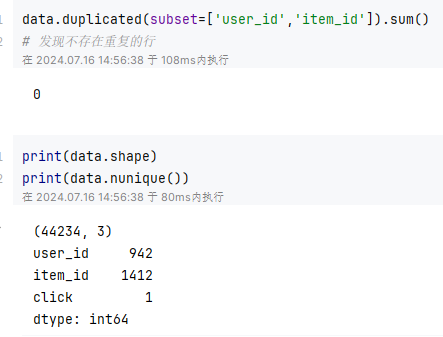
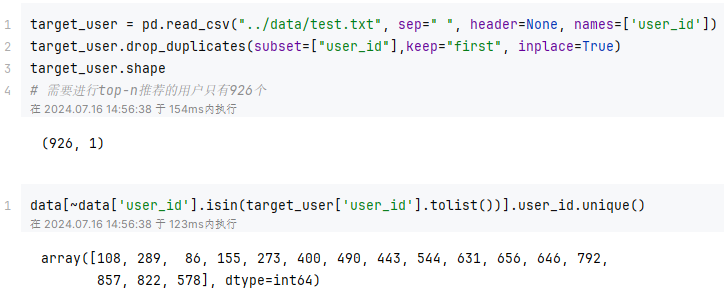
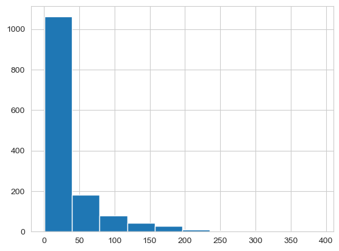
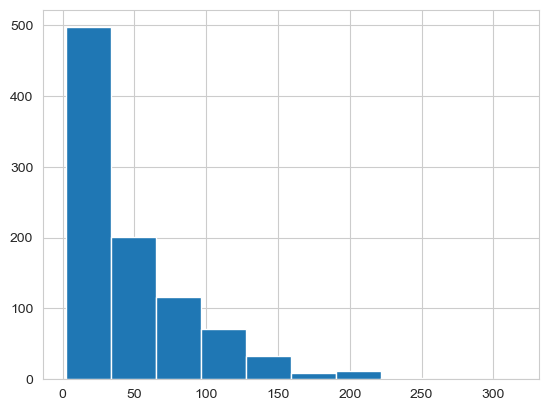

# Top-10推荐实验报告

## 1.数据探索与预处理

首先对训练数据集`training.txt`进行简单的探索：

发现数据包含`44234`条数据，不存在重复数据。其中用户数量`942`，物品数量`1412`。



接下来对测试数据集`test.txt`进行简单的探索：

发现共包含`926`的用户，也就是说有`16`个用户不在test中。



接下来，发现`user_id`和`item_id`并不是按照顺序进行编号的，所以我们需要将编号重新映射一次：

```python
# user_id编号最小是1，最大是943，item_id编号最小是1，最大是1674。因此需要将编号重新映射一次
# 创建用户ID和物品ID的映射
user_id_map = {id: i for i, id in enumerate(data['user_id'].unique())}
item_id_map = {id: i for i, id in enumerate(data['item_id'].unique())}

# 应用映射
data['user_id'] = data['user_id'].map(user_id_map)
data['item_id'] = data['item_id'].map(item_id_map)
target_user['user_id'] = target_user['user_id'].map(user_id_map)
```

**统计每个物品对应的用户数：**



```txt
百分数	  用户数
0.0      1.0
0.1      1.0
0.2      2.0
0.3      4.0
0.4      7.0
0.5     11.0
0.6     20.0
0.7     31.0
0.8     50.0
0.9     88.0
1.0    391.0
```

可以发现大概有50%左右的物品有超过10个用户点击。

**统计每个用户对应的物品数：**



```txt
百分数	  物品数
0.0      2.0
0.1      9.0
0.2     13.2
0.3     18.0
0.4     23.0
0.5     31.0
0.6     39.0
0.7     56.0
0.8     77.0
0.9    108.9
1.0    316.0
```

可以发现有80%左右的用户点击了超过10件物品

## 2.模型搭建

### 2.1 训练集拆分

对于训练数据集

### 2.2协同过滤基线

### 2.3基于图的推荐（最终模型）

